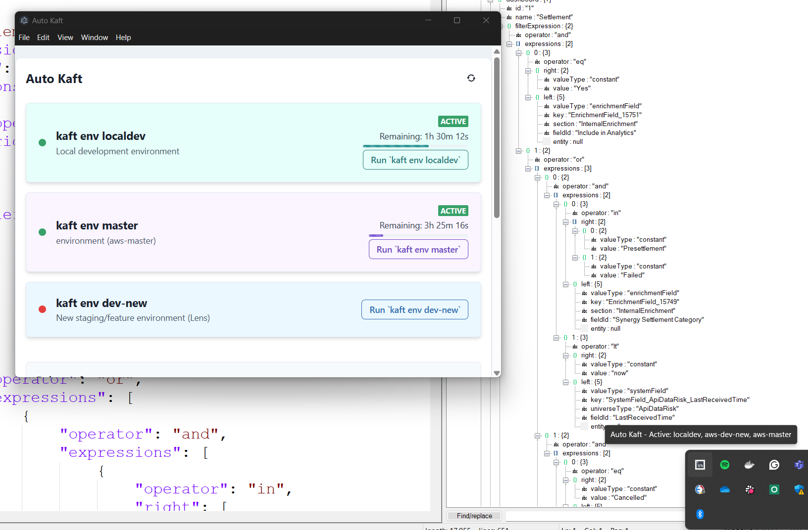

# Auto Kaft

A **desktop application** built with **Electron and React (Vite)** for managing CLI commands (specifically `kaft env` and `kaft status`) with timers for different environments.

## Features

- Execute `kaft env <environment>` commands.
- Check `kaft status`.
- Automatic 4-hour timers for each environment activation.
- Timer persistence across application restarts (using localStorage).
- System tray icon with hover tooltip showing current environment status (based on last `kaft status` check).
- Modern UI with Chakra UI.

## Demo



## Prerequisites

- Node.js 16 or higher
- npm or yarn
- The `kaft` CLI tool must be installed and available in your system's PATH.

## Installation

1.  Clone the repository:

    ```bash
    git clone <repository-url> # Replace with your repo URL
    cd cli-command-ui
    ```

2.  Install dependencies:

    ```bash
    npm install
    # or
    yarn install
    ```

## Running the Application (Development)

1.  Start the application (frontend development server and Electron app):

    **Option 1: Using npm/yarn**

    ```bash
    npm run electron:start
    # or
    yarn electron:start
    ```

    **Option 2: Using the script (Windows)**

    ```bash
    ./start-dev.cmd
    ```

    Either command does two things concurrently:

    - Starts the Vite development server for the React frontend (usually on `http://localhost:5173`).
    - Starts the Electron application, which will load the frontend from the Vite server.

The application will launch in an Electron window.

## Project Structure

```
auto-kaft/
├── electron/             # Electron Main process files
│   ├── main.js           # Main process entry point, handles window creation and IPC
│   └── preload.js        # Exposes Node/Electron APIs securely to the Renderer
├── public/               # Static assets
├── src/                  # React Frontend (Renderer process)
│   ├── components/       # React components (e.g., Timer)
│   ├── App.jsx           # Main React application component
│   └── main.jsx          # React application entry point
├── .eslintrc.cjs         # ESLint configuration
├── .gitignore
├── index.html            # HTML template for Vite
├── package.json          # Project metadata and dependencies
├── README.md             # This file
├── start-dev.cmd         # Development startup script (Windows)
└── vite.config.js        # Vite configuration
```

## Development Notes

- Frontend code (React) is in the `src` directory. This runs in Electron's **Renderer Process**.
- Electron-specific code (window management, native API access, command execution) is in the `electron` directory. This runs in Electron's **Main Process**.
- Communication between the Frontend (Renderer) and the Main process happens via IPC, configured in `electron/main.js` and `electron/preload.js`.
- The `kaft` commands are executed directly by the Electron Main process using Node.js `child_process`.

## Linting

```bash
npm run lint
# or
yarn lint
```

## Building for Production (Example)

While not explicitly configured in `package.json`, you would typically use a tool like `electron-builder` or `electron-packager` to bundle the application into distributable formats (e.g., `.exe`, `.dmg`, `.appimage`). This usually involves:

1.  Building the React frontend: `npm run build`
2.  Configuring and running the packager tool.

Refer to the documentation of `electron-builder` or `electron-packager` for detailed instructions.

## License

MIT
